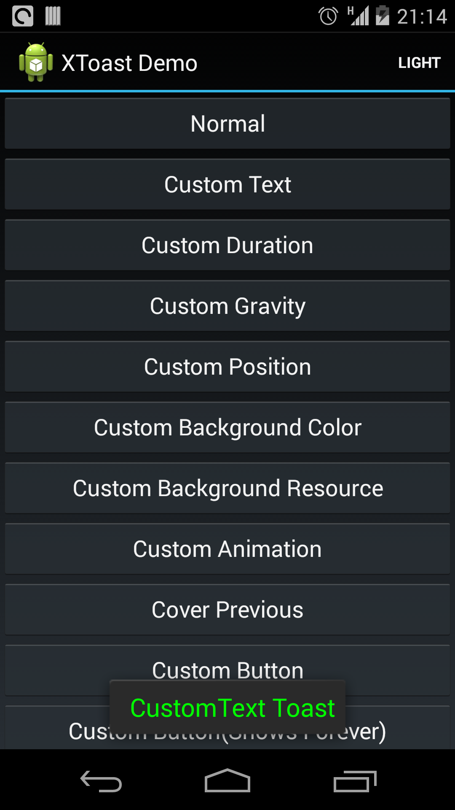
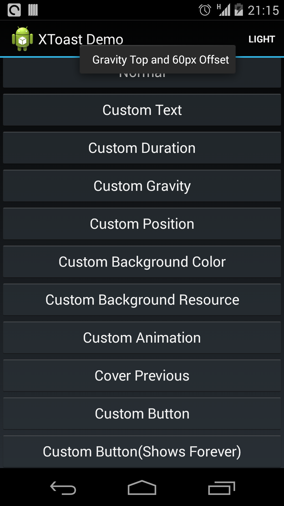
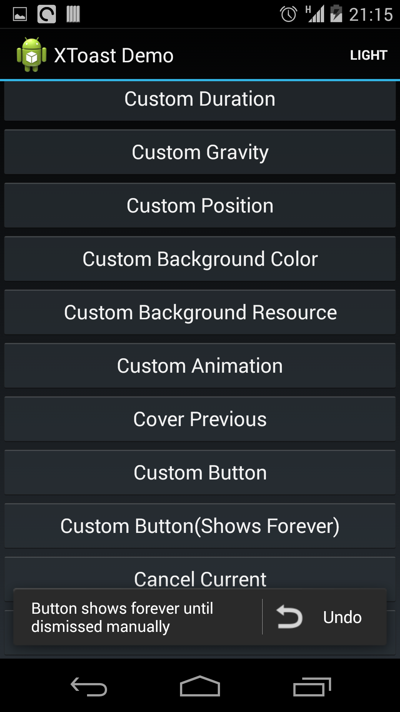
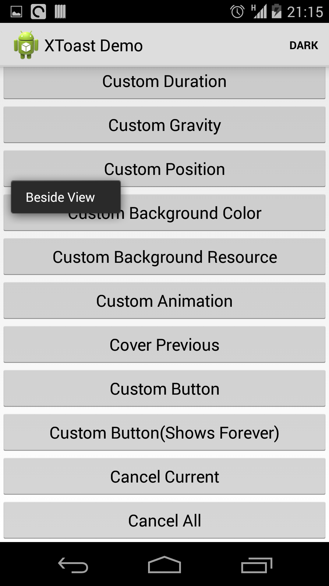
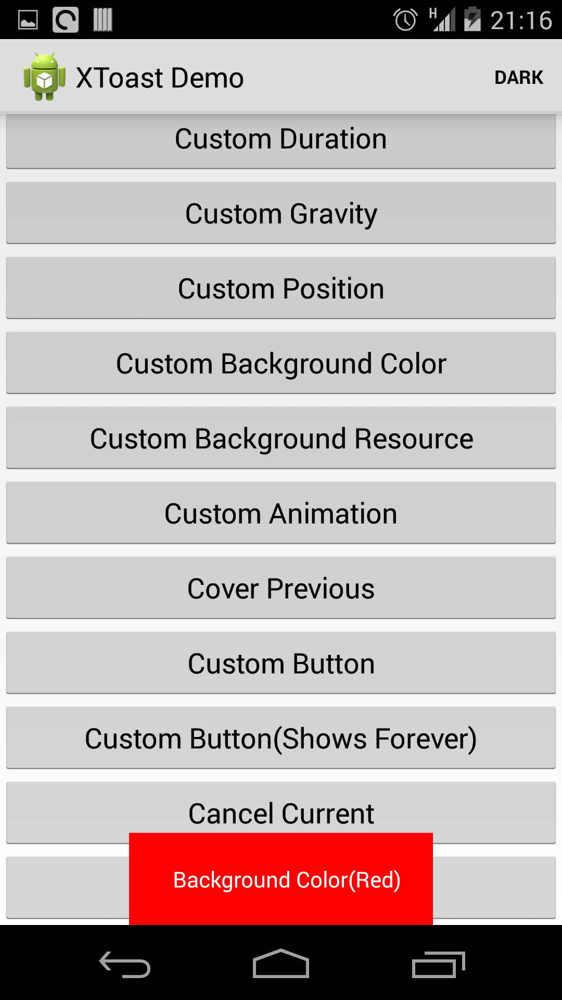

XToast
====
A simple android custom toast(Simplified version of SuperToasts).

## Screenshots







## Usage

- Basic

```java
XToast.create(Context, "Text to show").show();
```

- Custom

```java
XToast.create(Context, "Text to show").withTextSize(20).withBackgroundColor(Color.parseColor("#FF00000")).show();
```

All configurations are in the form of withXxx() methods.

----

**It now supports the following configurations:**

### 1. Text size/color

```java
withTextSize(int)
withTextColor(int)
```

### 2. Duration

```java
withDuration(int)
```

There are several build-in duration in `XToast.Duration`.

Use `XToast.Duration.FOREVER` if you do not want it dismissed automatically.

### 3. Background color/resource

```java
withBackgroundColor(int)
withBackgroundResource(int)
```

### 4. Animation

```java
withAnimation(int)
```

There are several built-in animations in `XToast.Anim`.

### 5. Gravity and offset

```java
withGravity(int, int, int)
```

### 6. Cover previous toast

```java
withCover(boolean)
```

Cancel all the other toasts before this one shows.

### 7. Button integration(text/icon/event)

```java
withButton(CharSequence, Drawable, XToast.ButtonClickListener)
withButton(CharSequence, Drawable, XToast.ButtonClickListener, boolean)
withButton(CharSequence, int, XToast.ButtonClickListener)
withButton(CharSequence, int, XToast.ButtonClickListener, boolean)
```

Note: If you want to show only the button, with no toast text, just do like this:

```java
XToast.create(Context, null).withButton(...);
```

### 8. Position relative to a specified view

```java
withPosition(View, int, int, int)
```

See position options in `XToast.Position`.

**Note:** After calling this method, do not call withGravity() anymore because they could be messed up.
